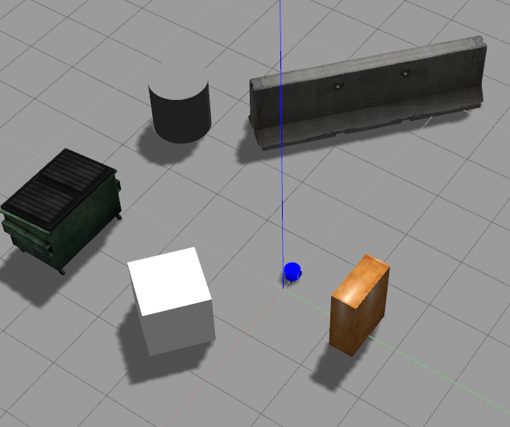

在Gazebo中添加一个机器人是基本操作，在多机协同智能任务中，需要在Gazebo中添加多个机器人用于仿真。我们首先不考虑多个机器人间的通信以及传感器的协同，只考虑在场景中放入多个机器人。

<!-- more -->

## 放入一个机器人的方法
我们通过一个launch文件来实现，主要步骤是：构建Gazebo仿真环境——加载机器人模型描述参数——在Gazebo中加载机器人模型。
```
<launch>

    <!-- 设置launch文件的参数 -->
    <arg name="world_name" value="$(find mrobot_gazebo)/worlds/playground.world"/>
    <arg name="paused" default="false"/>
    <arg name="use_sim_time" default="true"/>
    <arg name="gui" default="true"/>
    <arg name="headless" default="false"/>
    <arg name="debug" default="false"/>

    <!-- 运行gazebo仿真环境 -->
    <include file="$(find gazebo_ros)/launch/empty_world.launch">
        <arg name="world_name" value="$(arg world_name)" />
        <arg name="debug" value="$(arg debug)" />
        <arg name="gui" value="$(arg gui)" />
        <arg name="paused" value="$(arg paused)"/>
        <arg name="use_sim_time" value="$(arg use_sim_time)"/>
        <arg name="headless" value="$(arg headless)"/>
    </include>

    <!-- 加载机器人模型描述参数 -->
    <param name="robot_description" command="$(find xacro)/xacro --inorder '$(find mrobot_gazebo)/urdf/mrobot.urdf.xacro'" /> 

    <!-- 在gazebo中加载机器人模型-->
    <node name="urdf_spawner" pkg="gazebo_ros" type="spawn_model" respawn="false" output="screen"
          args="-urdf -model mrobot -param robot_description"/> 

</launch>
```
效果图如下：  


## 放入多个机器人的办法
与放入单个机器人的主要区别是需要设置不同的命名空间，在group中执行操作。代码如下：
```
<launch>
  
  <arg name="car1_namespace" default="/car1"/>
  <arg name="car2_namespace" default="/car2"/>
  <arg name="robot" default="xbot-u"/>
  <arg name="debug" default="false"/>
  <arg name="gui" default="true"/>
  <arg name="headless" default="false"/>

  <!-- Start Gazebo with a blank world -->
  <include file="$(find gazebo_ros)/launch/empty_world.launch">
    <arg name="world_name" value="$(find robot_sim_demo)/worlds/ROS-Academy.world"/>
    <!--arg name="world_name" value="$(find turtlebot_gazebo)/worlds/playground.world"/-->
    <arg name="debug" value="$(arg debug)" />
    <arg name="gui" value="$(arg gui)" />
    <arg name="paused" value="false"/>
    <arg name="use_sim_time" value="true"/>
    <arg name="headless" value="$(arg headless)"/>
  </include>

  <!--include file="$(find robot_sim_demo)/launch/include/test.launch.xml" /-->
 
  <!--node    name="rviz"    pkg="rviz"    type="rviz"    args="-d $(find robot_sim_demo)/urdf_gazebo.rviz" /-->
  <group ns="$(arg car1_namespace)">
  <arg name="x1" default="5.0" />
  <arg name="y1" default=".0" />
  <arg name="z1" default="0.0" />
  <arg name="yaw1" default="-2.0" />
  <param name="robot_description" command="$(find xacro)/xacro.py $(find robot_sim_demo)/urdf/robot1.xacro
      --inorder
      ns:=$(arg car1_namespace)
      " />
  <node name="urdf_spawner1" pkg="gazebo_ros" type="spawn_model" respawn="false" output="screen"
        args="-urdf -x $(arg x1) -y $(arg y1) -z $(arg z1) -Y $(arg yaw1) -model xbot-u1 -param robot_description -unpause"/>

  </group>

  <group ns="$(arg car2_namespace)">
  <arg name="x2" default="0.0" />
  <arg name="y2" default=".0" />
  <arg name="z2" default="0.0" />
  <arg name="yaw2" default="-2.0" />
  <param name="robot_description" command="$(find xacro)/xacro.py $(find robot_sim_demo)/urdf/robot2.xacro
      --inorder
      ns:=$(arg car2_namespace)
      " />
  <node name="urdf_spawner2" pkg="gazebo_ros" type="spawn_model" respawn="false" output="screen"
        args="-urdf -x $(arg x2) -y $(arg y2) -z $(arg z2) -Y $(arg yaw2) -model xbot-u2 -param robot_description -unpause"/>

  </group>

</launch>
```
- 首先在文件开头定义两个命名空间car1、car2
- 分别在`<group ns="$(arg car1_namespace)>`和`<group ns="$(arg car1_namespace)>`中进行放入一个机器人的操作
- 构建机器人的节点中，model的名字一定要不同
- 特别需要注意，最好`robot_description`加载的配置文件要分开，以防出现共用同一命名空间的现象（比如在某个配置文件里，定义了一个类似于`/xbot`这样的全局空间，这样就会有冲突，造成只能生成一个机器人的现象）。

最终效果图：  


